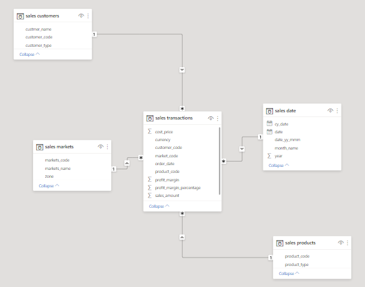
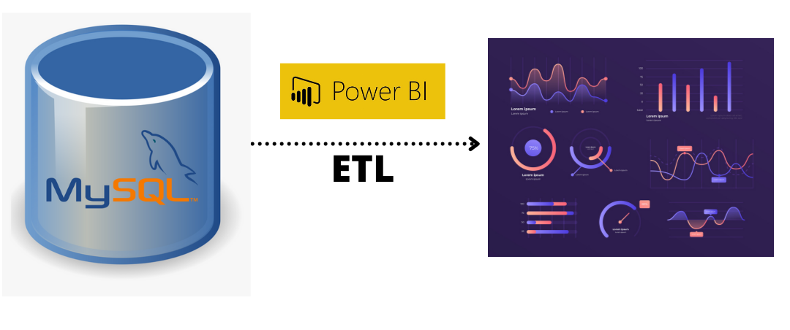

# Modelagem de Dados com Power BI 

## Introdução

Esse é um projeto para praticar modelagem de dados com Power BI.

AtliQ é uma empresa é uma empresa que fornece hardware de computador e periféricos para muitos clientes através da Índia. Esse projeto vem com propósito de desbloquear insights de vendas que não eram visíveis para uma equipe de vendas. Automatizá-los para reduzir o tempo manual na coleta de dados. Definindo um star schema e escrevendo o pipeline ETL, os dados baseados em arquivos sql que será transferido para o Power BI para limpeza e dai criar um dashboard para suporte e decisões futuras.
## Data Schema e Pipeline ETL 

### Data Schema

AtliQ está crescendo bastante no mercado e precisa de ajuda para rastrear suas vendas e ter insights sobre seu negócio.

Até então, as vendas eram passadas pelos gerentes regionais na Índia, no qual informavam sobre as vendas e o lucro previsto para aquela região. Fazendo uso de um banco de dados MySQL, temos o seguinte modelo:

- Star Schema: **sales transactions**, e 
- Demais Schemas: **sales customers**, **sales markets**, **sales products** e **sales date**.

Com os dados provenientes da emopresa, iremos fazer um dashboard automatizado em Power BI para suporte e decisões sobre a empresa de forma otimizada.  

### ETL Pipeline

O ETL pipeline extrai os dados do arquivo `db_dump.sql` e produz um dashboard utilizando o `ETL_mysql.pbix`, como você pode observar abaixo

## Como executar

### Pré-requisitos

Se você deseja executar esse projeto em sua máquina, você deve finalizar os seguintes passos primeiro.

- Instalar `MySQL`
- Instalar `PowerBI` em sua máquina

### Instruções
1. Criar schema no MySQL
2. Importar o arquivo `db_dump.sql` nessa schema.
3. Analisar como estão os dados, se é preciso ser feita alguma limpeza.
4. Importar os dados no Power BI, importando como uma base de dados MySQL.
5. Fazer a limpeza que será descrita abaixo e criar o dashboard de vendas referente ao arquivo `ETL_mysql.pbix`.
